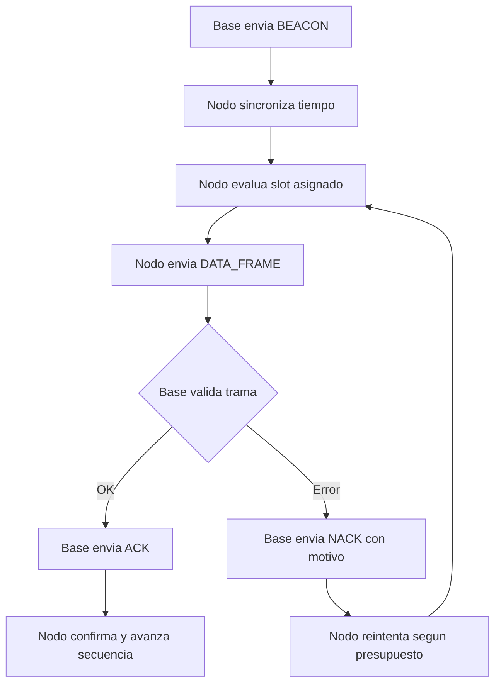

# Arquitectura del Sistema v1

## Resumen ejecutivo

ADQ-protocolo opera como una red estrella de adquisicion inalambrica con sincronizacion temporal y entrega confiable para strain gauge.

Baseline vigente:

- Hardware radio objetivo: nRF52840
- Banda: 2.4 GHz
- MAC: propietario ESB-like con planificacion determinista
- Alcance objetivo v1: hasta 100 m LOS

## Objetivos tecnicos de v1

- Evitar colisiones con slots por nodo.
- Reducir perdida silenciosa a cero (todo drop debe quedar reportado).
- Recuperar enlace tras cortes breves sin perder trazabilidad.
- Exponer metricas de calidad de enlace y confiabilidad.

## Dominios

- Nodo: adquiere, empaqueta, transmite y recupera.
- Base: sincroniza, agenda slots, recibe y confirma.
- Host: registra, visualiza y exporta evidencia.

## Flujo operativo

## Capas practicas

- L1 (PHY): radio 2.4 GHz del SoC.
- L2 (MAC): beacon, slots, ACK/NACK, retry, timeout.
- L2.5 (adaptacion): fragmentacion/reensamble de tramas largas.
- L7 (aplicacion): mensajes ADQ, secuencia, diagnostico.

## Componentes de robustez

- CRC16 en cada trama.
- Parser FSM para stream continuo.
- Scheduler de slots por nodo.
- Gestor de transacciones con timeout/retry.
- Estado de recovery en nodo para recobrar sincronizacion.

## Criterios de aceptacion de arquitectura v1

- Enlace estable en 100 m LOS.
- Evidencia de ACK/NACK y retries por nodo.
- Deteccion de errores sin perdida silenciosa.
- Recuperacion automatica tras perdida temporal de enlace.
