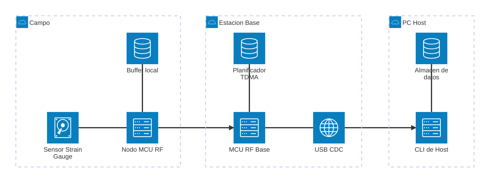
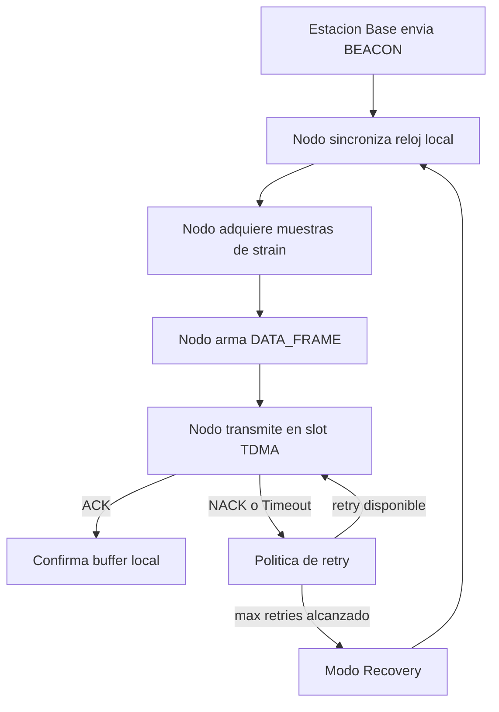
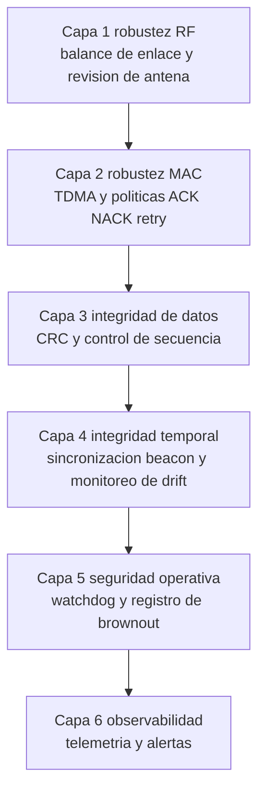

# Arquitectura del Sistema v1

## En pocas palabras

Este proyecto permite medir strain gauge en puntos lejanos y enviar esas mediciones por radio a una estacion base, evitando cables muy largos.

Objetivo practico: que puedas medir a 1-2 km sin perder datos importantes.

## Quien hace que

- Nodo: placa remota que mide sensores y transmite.
- Estacion Base: placa central que organiza la red y recibe datos.
- PC Host: computadora donde se configuran pruebas y se guardan resultados.

## Requerimientos mínimos del protocolo

- Alcance: 1-2 km en escenario principalmente LOS.
- Topologia: estrella (sin mesh en v1).
- Sincronizacion: objetivo operativo ~1 ms entre nodos.
- Latencia extremo a extremo: 100-500 ms.
- Interfaz de salida: USB CDC en estacion base.
- Prioridad: funcionalidad robusta para pruebas reales de campo.

## Diagrama de bloques

  Observación:

  1. El sensor entra al Nodo.
  2. El Nodo guarda temporalmente en Buffer local.
  3. El Nodo transmite a Estacion Base.
  4. Estacion Base envia por USB a PC Host.
  5. En PC Host se visualiza y se almacena.

## Datos y control de flujo

Observación:

1. Estacion Base envia un BEACON para alinear tiempo.
2. Nodo mide y arma una trama DATA_FRAME.
3. Nodo transmite en su turno TDMA.
4. Si recibe ACK, confirma entrega.
5. Si recibe NACK o timeout, reintenta.
6. Si falla varias veces, entra en modo Recovery.

## Dominios de ejecucion

En esta parte, "dominios" solo significa "zonas de trabajo" del sistema.

- Dominio Nodo: lo que pasa dentro de cada nodo remoto.
- Dominio Base: lo que pasa dentro de la Estacion Base.
- Dominio Host: lo que pasa en la PC (software y visualizacion).

Si te ayuda, piensa en una fábrica:

- Nodo = operario que mide y empaqueta.
- Base = supervisor que ordena turnos y confirma entregas.
- Host = oficina que guarda historico y genera reportes.

### Resumen

| Dominio | Funcion principal | Ejemplo simple |
|---|---|---|
| Nodo | Medir, empaquetar y enviar | "Tome una muestra, la guardo y la envio" |
| Base | Coordinar y validar | "Te doy turno, recibo y te confirmo ACK" |
| Host | Configurar y analizar | "Muestro graficas y guardo datos" |

### Dominio Nodo

1. Lee el sensor strain gauge.
2. Convierte señal analogica a digital con ADC.
3. Arma una trama con timestamp, seq y payload.
4. Si no llega ACK, reintenta (retry).
5. Si hay corte, guarda temporalmente en buffer local.

Glosario del Nodo:

- ADC: convierte señal analogica en datos digitales.
- CRC: revisa si la trama se daño en el camino.
- seq (sequence): numero de orden de trama.
- watchdog: reinicia si el nodo se bloquea.

### Dominio Base

1. Envia BEACON para que todos tengan referencia de tiempo.
2. Define turnos de envio (TDMA slots) para evitar choques.
3. Recibe tramas de nodos y valida CRC/seq.
4. Responde ACK o NACK.
5. Reenvia datos por USB CDC hacia la PC.

Glosario de la Base:

- beacon scheduler: tarea que envia BEACON periodico.
- slot assignment: asignacion de turno a cada nodo.
- sequence gap detection: detecta si falta una trama.

### Dominio Host

1. Configura parametros de prueba (rate, duracion, nodos).
2. Recibe datos desde la Base.
3. Muestra estado (RSSI, retries, drift).
4. Guarda todo para analisis y reportes.

Glosario del Host:

- metadata: datos de contexto del experimento.
- pipeline de export: flujo para pasar datos a CSV/analisis.

## Que significa robustez aqui

Robustez significa que el sistema aguanta condiciones reales de campo:

- Ruido de radio.
- Perdida temporal de enlace.
- Errores de paquetes.
- Reinicios del nodo.

Elementos que ayudan a la robustez:

- CRC para detectar corrupcion de datos.
- ACK/NACK para saber si la entrega fue correcta.
- Buffer local para no perder datos durante cortes.
- Modo Recovery para recuperar sincronizacion.

## Capas de control

Lectura por capas:

- Capa 1-2: que el enlace de radio sea estable.
- Capa 3-4: que datos y tiempo sean confiables.
- Capa 5-6: que el sistema sea operable y diagnosticable.

## Criterios minimos de calidad para v1

- Ninguna perdida silenciosa: todo drop debe tener contador y causa.
- Retransmisiones acotadas por politica explicita y auditable.
- Drift y offset temporal medidos en campo y registrados.
- Trazabilidad requisito -> decision -> prueba -> evidencia.

## Limites de la v1

Esta v1 no incluye todavia:

- Mesh networking.
- Seguridad completa de producto (secure boot + full anti-replay en todo el sistema).
- OTA de produccion.
