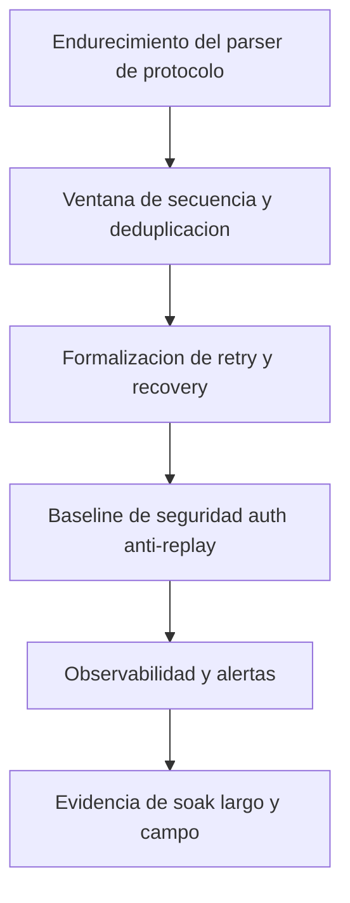

# Engineering Readiness Review

## Executive summary

El proyecto ya tiene una base buena de arquitectura y protocolo. Para llevarlo a nivel top de ingenieria y operacion real continua faltan cuatro bloques: robustez formal de protocolo, seguridad de producto, operacion observables y validacion sistematica de campo.

## Current maturity snapshot

- Architecture baseline: present.
- Protocol baseline: present.
- Basic implementation scaffold: present.
- Hardware-specific integration: pending.
- Security hardening: pending.
- Reliability stress evidence: pending.

## Gap analysis by severity

### Critical gaps

1. Falta parser de stream robusto con maquina de estados.
2. Falta estrategia formal anti-duplicado y anti-gap por ventana de secuencia.
3. Falta control de autenticacion y anti-replay.
4. Falta politica de recuperacion persistente ante reset durante backlog.

### High gaps

1. Falta observabilidad de campo en tiempo real (health dashboard o export estructurado).
2. Falta test de soak >24h con reporte estandarizado.
3. Falta procedimiento de calibracion de front-end strain gauge documentado.
4. Falta especificacion de budgets: latencia, perdida, deriva, consumo.

### Medium gaps

1. Falta estrategia OTA firmada para mantenimiento.
2. Falta FMEA del nodo y basestation.
3. Falta plan de fabricacion/test de placa (ICT/functional).

## Risk matrix

| Risk | Impact | Likelihood | Mitigation |
|---|---|---|---|
| Frame desync in noisy channel | High | Medium | Stateful parser + strict framing + watchdog reset of parser |
| Data loss during temporary outage | High | Medium | Persistent buffer + replay after reconnect |
| Node spoofing | High | Medium | PSK auth + frame counters + MAC |
| Time drift accumulation | Medium | Medium | Periodic beacon sync + drift alarm |
| Brownout resets | Medium | High | Brownout detection + transactional buffer commit |

## Robustness roadmap

## Recommended robustness requirements (top project profile)

1. Reliability
- End-to-end delivery accounting (no silent drops).
- Configurable retry policy with per-node telemetry.
- Sequence window and duplicate suppression.

2. Timing
- Sync quality metric exported continuously.
- Drift threshold alarms with auto-resync.

3. Security
- Node identity and network admission control.
- Frame counter monotonic checks.
- Signed firmware images and secure boot chain.

4. Operations
- Structured logs with event codes.
- Reproducible runbook for field technicians.
- One-command data export for incident analysis.

5. Quality
- Gate release only with test evidence pack.
- Regression suite on every protocol change.

## What to implement next (ordered)

1. Stateful stream parser in base and host.
2. Sequence window + duplicate filter.
3. ACK policy with explicit reason taxonomy.
4. Security v1.1 baseline (auth + anti-replay).
5. 24h soak campaign and field campaign template.
