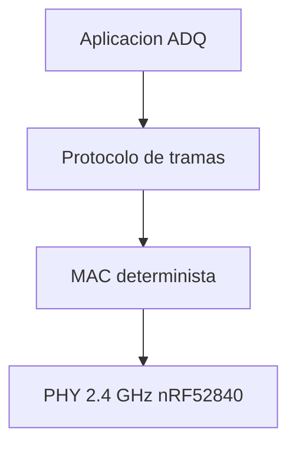
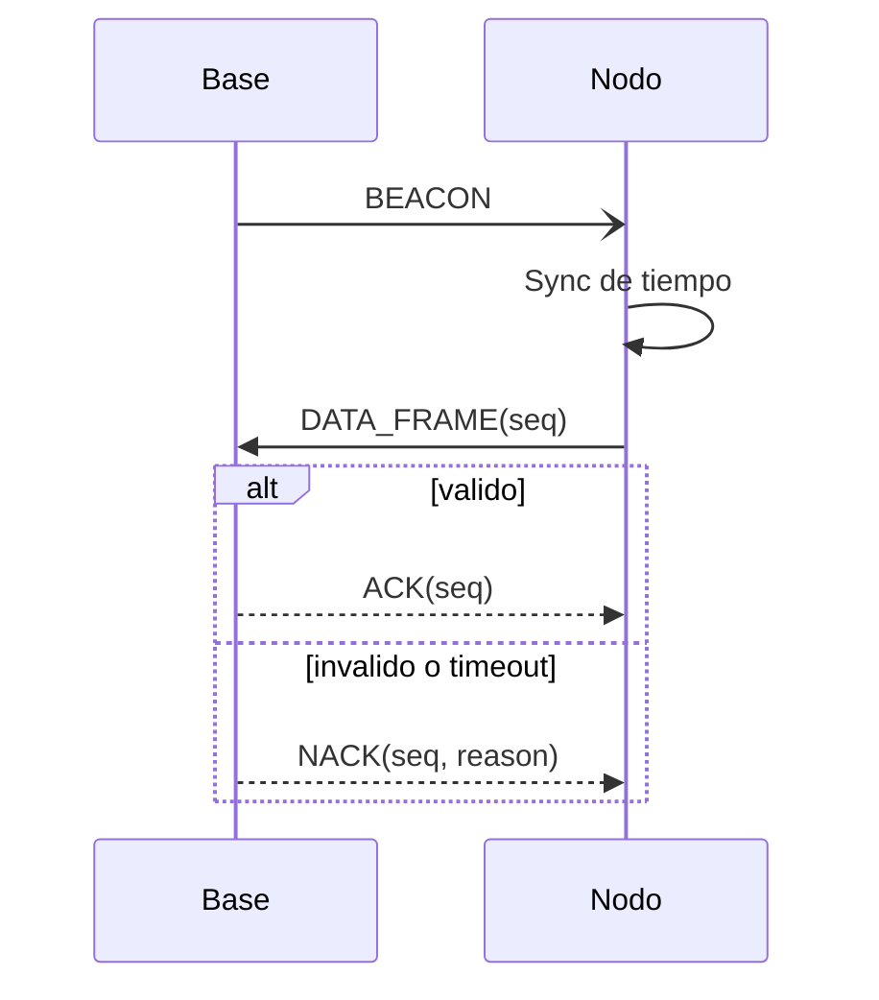
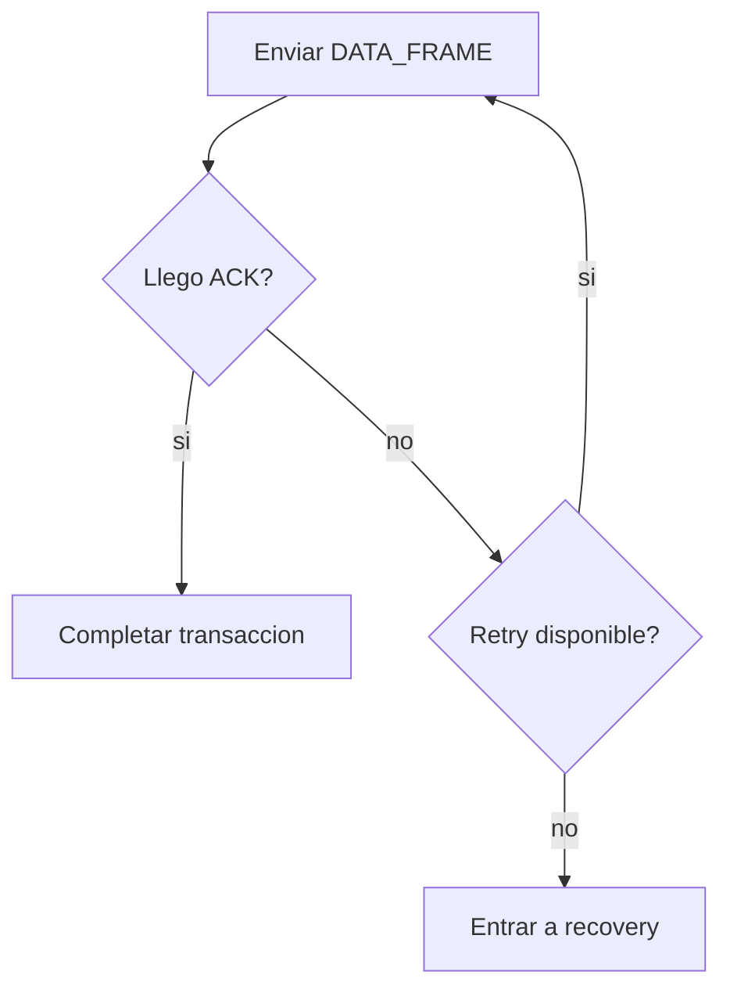
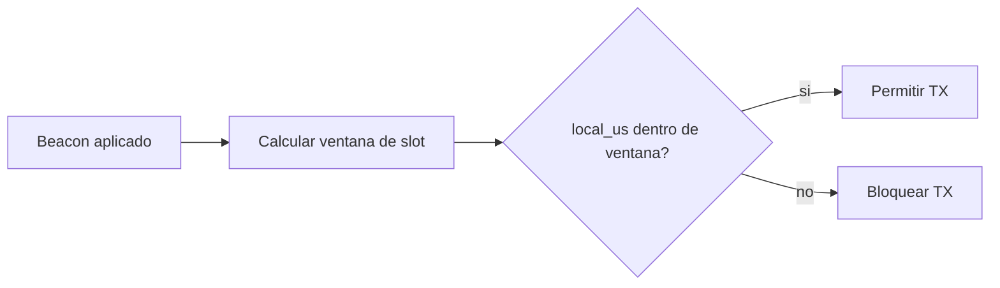
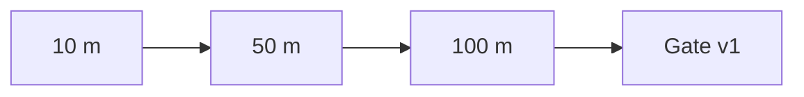

# Diagramas Educativos del Protocolo (v1 vigente)

## 1) Stack logico

```mermaid
flowchart TB
  A[Aplicacion ADQ] --> B[Protocolo de tramas]
  B --> C[MAC determinista]
  C --> D[PHY 2.4 GHz nRF52840]
```

## 2) Flujo base de operacion

```mermaid
sequenceDiagram
  participant B as Base
  participant N as Nodo

  B-)N: BEACON
  N->>N: Sync de tiempo
  N->>B: DATA_FRAME(seq)
  alt valido
    B-->>N: ACK(seq)
  else invalido o timeout
    B-->>N: NACK(seq, reason)
  end
```

## 3) Control de retry

```mermaid
flowchart TD
  A[Enviar DATA_FRAME] --> B{Llego ACK?}
  B -->|si| C[Completar transaccion]
  B -->|no| D{Retry disponible?}
  D -->|si| A
  D -->|no| E[Entrar a recovery]
```

## 4) Slot gating en nodo

```mermaid
flowchart LR
  A[Beacon aplicado] --> B[Calcular ventana de slot]
  B --> C{local_us dentro de ventana?}
  C -->|si| D[Permitir TX]
  C -->|no| E[Bloquear TX]
```

## 5) Objetivo de validacion

```mermaid
flowchart LR
  A[10 m] --> B[50 m] --> C[100 m] --> D[Gate v1]
```
