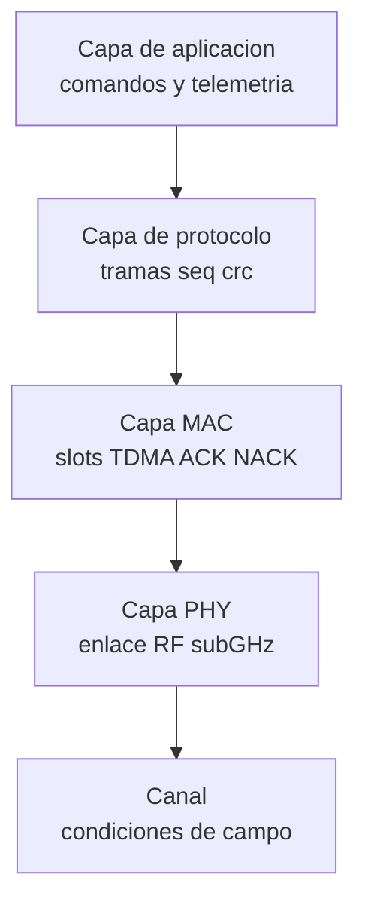
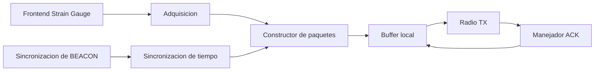
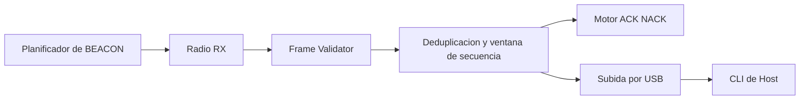
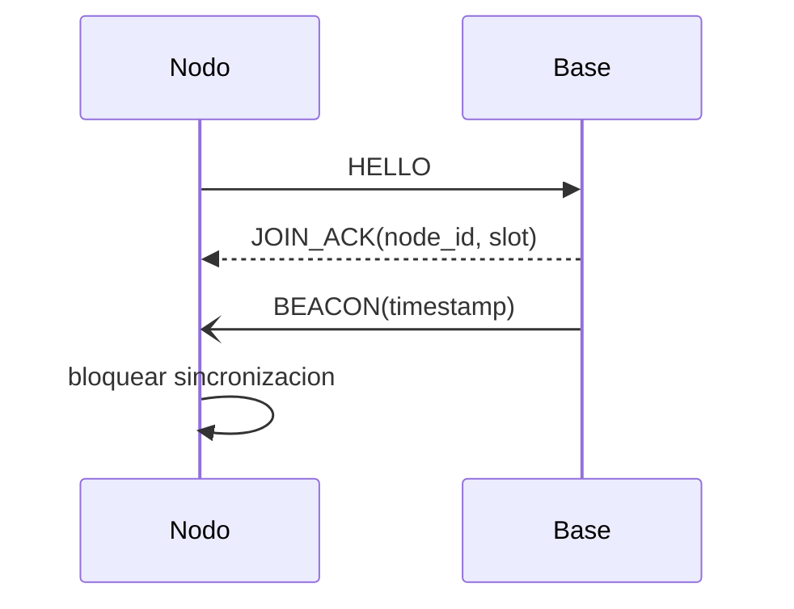
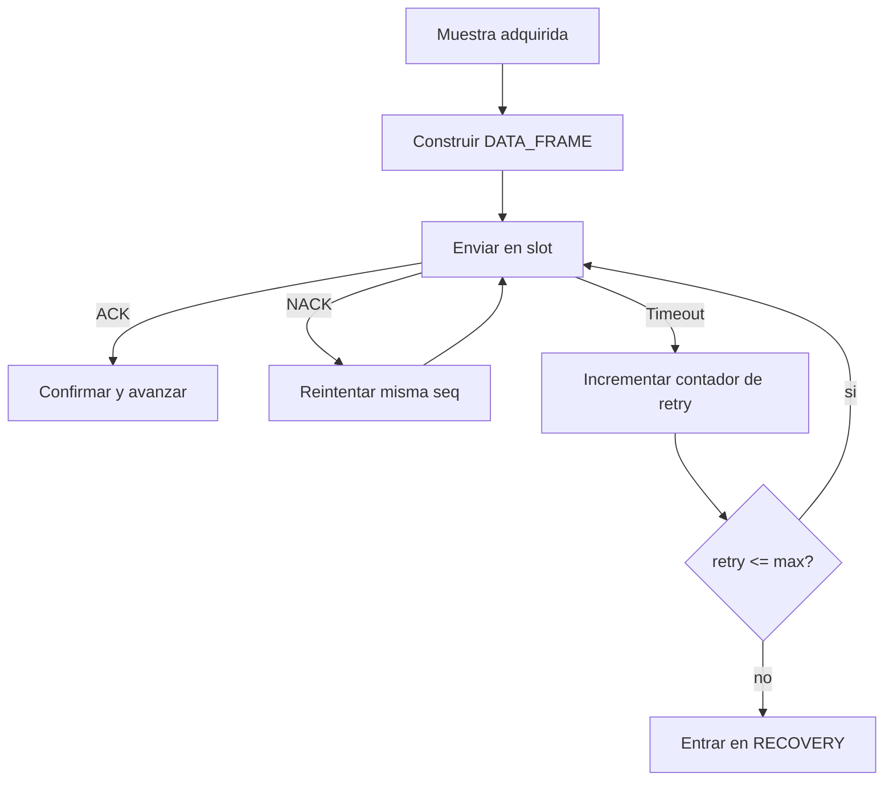
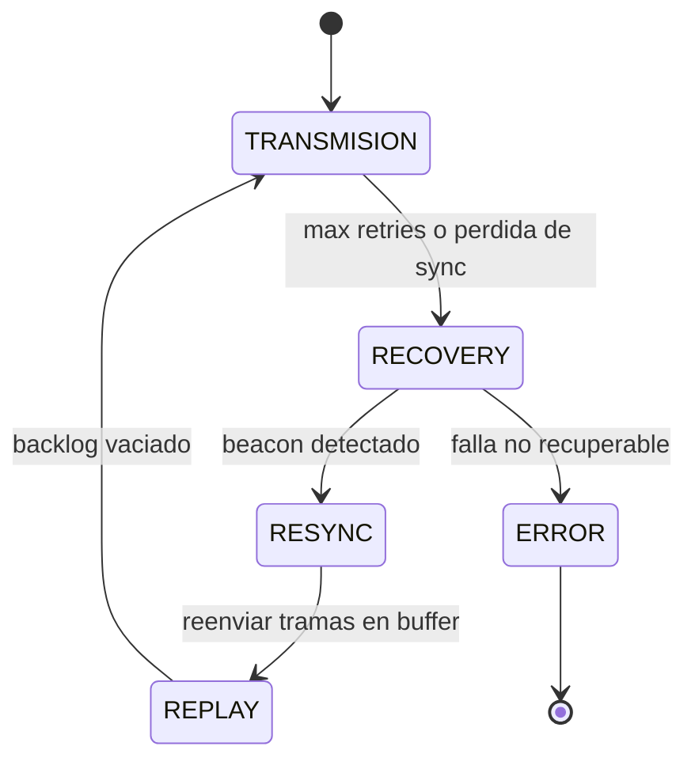
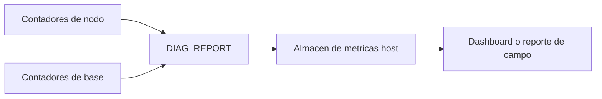
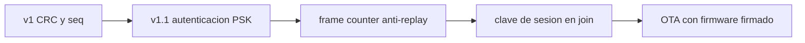

# Diagramas Educativos del Protocolo

Este documento concentra diagramas para explicar de forma didactica como funciona el protocolo extremo a extremo.

## 1) Diagrama de bloques por capas

- El sistema esta dividido por capas, cada una con una responsabilidad.
- Si falla una capa, sabes donde depurar primero.

## 2) Módulos internos del Nodo

- El Node no solo mide; tambien empaqueta, guarda temporalmente y reintenta.

## 3) Módulos internos de la Estación Base

- La Base Station valida, ordena y responde, no es solo un receptor pasivo.

## 4) Ciclo de unión

- Antes de medir, el Node debe unirse y sincronizarse.

## 5) Flujo de streaming y confiabilidad

- ACK/NACK es el mecanismo central para evitar perdidas silenciosas.

## 6) Flujo de estados de recuperación

- Recovery no es error final; es un modo para volver a estado estable.

## 7) Flujo de observabilidad operativa

- Sin metricas y logs no hay forma profesional de operar en campo.

## 8) Ruta de endurecimiento de seguridad (v1 a v1.1)

- La seguridad se construye por etapas; en v1 suele ser basica y en v1.1 se endurece.

