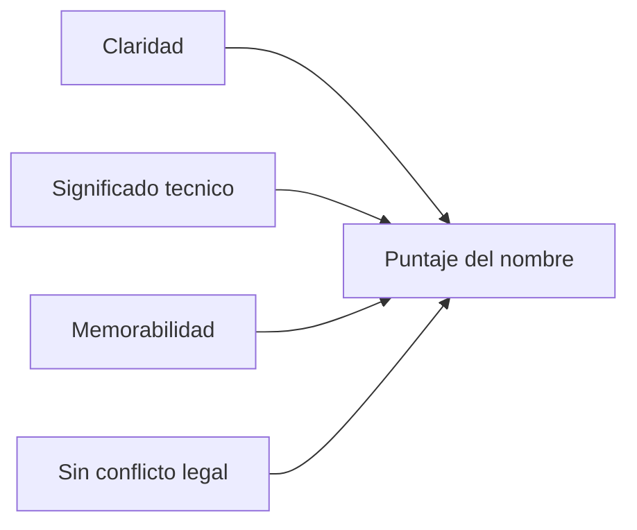

# Protocol Name Proposals

## Naming criteria

- Debe comunicar fiabilidad y sincronizacion.
- Debe ser corto para firmware/docs/CLI.
- Debe ser pronunciable en espanol e ingles.
- Debe evitar conflicto evidente con marcas existentes.

## Top candidate names

### 1) SARA

- Expansion: Synchronized Acquisition Robust Architecture.
- Why good: corto, facil de recordar, comunica sincronizacion y robustez.
- Suggested protocol id: `sara-v1`.

### 2) ARES

- Expansion: Acquisition Resilient Engineering System.
- Why good: tono fuerte de ingenieria, ideal para version industrial.
- Suggested protocol id: `ares-v1`.

### 3) STRIDE

- Expansion: Synchronized Telemetry with Reliable Integrated Data Exchange.
- Why good: sugiere avance continuo y telemetria confiable.
- Suggested protocol id: `stride-v1`.

### 4) NEXUS-SG

- Expansion: Node Exchange Unified Sync for Strain Gauge.
- Why good: explicito para caso strain gauge y red nodo-base.
- Suggested protocol id: `nexus-sg-v1`.

### 5) RIFT

- Expansion: Reliable Industrial Field Telemetry.
- Why good: orientado a campo e industria.
- Suggested protocol id: `rift-v1`.

## Recommendation

Si quieres un nombre equilibrado entre tecnico y facil de branding, recomiendo:

1. `SARA` (mejor equilibrio general)
2. `ARES` (perfil industrial fuerte)
3. `NEXUS-SG` (maxima especificidad de dominio)

## Naming style guide

- Nombre comercial: `SARA Protocol`.
- Identificador tecnico: `sara-v1`.
- Prefijo de mensajes en docs: `SARA_MSG_*`.
- Prefijo de libreria: `sara_` o `adq_` si mantienes continuidad del codigo actual.
