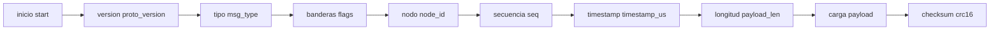
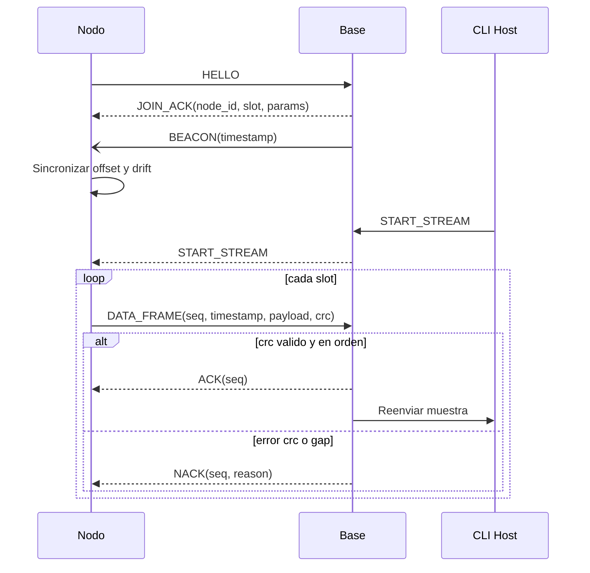
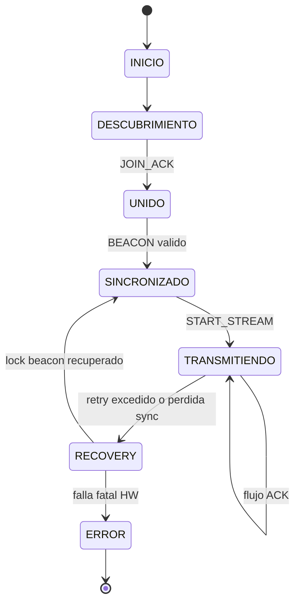

# Wireless Protocol v0.1 (Draft)

## Explicacion rapida (30 segundos)

El protocolo define como hablan Node y Base Station:

1. Se presentan (HELLO/JOIN_ACK).
2. Se sincronizan en tiempo (BEACON).
3. Entran en envio de datos (DATA_FRAME).
4. Confirman recepcion (ACK/NACK).
5. Si algo falla, reintentan o entran en RECOVERY.

## Goal

Definir un protocolo portable para topologia estrella con:

- sincronizacion por beacon
- ACK/NACK con reintentos
- buffer local y recuperacion
- telemetria de diagnostico

## Para estudiantes: que es una trama

Una trama es un "paquete" de datos con una estructura fija. Si la estructura llega bien, se procesa. Si llega mal, se descarta y se pide reenvio.

## Design conventions

- Endianness: little-endian.
- Integridad: CRC-16-CCITT por trama.
- Versionado: `proto_version` en header.
- Trazabilidad de sesion: `node_id + seq + timestamp_us`.

## Common frame format

| Field | Bytes | Description |
|---|---:|---|
| start | 1 | Constant 0xA5 |
| proto_version | 1 | Protocol version |
| msg_type | 1 | Message type |
| flags | 1 | Control bits |
| node_id | 2 | Logical node id |
| seq | 2 | Incremental sequence |
| timestamp_us | 8 | Node or network timestamp |
| payload_len | 2 | Payload length |
| payload | N | Message payload |
| crc16 | 2 | CRC over header and payload |

Guia simple de campos:

- `node_id`: quien envio la trama.
- `seq`: numero de orden para detectar perdidos o duplicados.
- `timestamp_us`: cuando se genero.
- `crc16`: verificacion de integridad.

## Message catalog (v0.1)

- `0x01` HELLO
- `0x02` JOIN_ACK
- `0x03` BEACON
- `0x04` CONFIG_SET
- `0x05` START_STREAM
- `0x06` STOP_STREAM
- `0x07` DATA_FRAME
- `0x08` ACK
- `0x09` NACK
- `0x0A` HEARTBEAT
- `0x0B` DIAG_REPORT

## Catalogo en lenguaje simple

- HELLO: "Hola, quiero unirme".
- JOIN_ACK: "Te acepto, este es tu id/slot".
- BEACON: "Esta es la referencia de tiempo".
- START_STREAM: "Empieza a enviar datos".
- STOP_STREAM: "Deten el envio".
- DATA_FRAME: "Aqui van mis muestras".
- ACK: "Recibido OK".
- NACK: "No recibido correctamente, reenvia".

## DATA_FRAME payload (v0.1)

| Field | Bytes | Description |
|---|---:|---|
| sample_rate_hz | 2 | Sampling rate |
| channel_mask | 2 | Active channels |
| sample_count | 2 | Number of samples |
| battery_mv | 2 | Battery level |
| rssi_dbm | 1 | Last link RSSI |
| status_bits | 1 | ADC/radio status |
| samples | M | Encoded sample values |

## Join and streaming sequence

Lectura didactica:

1. Primero se arma la red (join).
2. Luego se alinea tiempo (beacon sync).
3. Finalmente se transmite en loop por slots.
4. El ACK/NACK controla confiabilidad.

## Node protocol state model

## Reliability profile (v1 target)

- Cada `DATA_FRAME` requiere `ACK` o `NACK`.
- `NACK` debe incluir codigo de causa y `seq` de referencia.
- Reintentos maximos por trama: configurable (`max_retries`).
- Persistencia minima de buffer local: suficiente para cubrir cortes breves.
- Politica anti-duplicados en base: descartar `seq` repetidos ya confirmados.

## Ejemplo mental de robustez

Si el Node envia la trama 120 y no recibe ACK:

1. No borra la trama del buffer.
2. Reintenta segun `max_retries`.
3. Si aun falla, pasa a RECOVERY.
4. Cuando vuelve el enlace, continua desde la trama pendiente.

## Robustness controls missing today (must add)

1. Reassembly parser por stream (stateful) para frames fragmentadas.
2. Ventanas de secuencia y deteccion formal de gaps.
3. Modo degradado ante mala calidad RF (rate fallback / payload compaction).
4. Heartbeat de enlace con timeout de liveness.
5. Fault codes normalizados para radio, ADC, energia y reloj.

## Security baseline (v1.1 recommended)

- Autenticacion de nodo mediante clave precompartida por red.
- Frame counter anti-replay.
- Derivacion de session key por join.
- Integridad autenticada (por ejemplo, CRC + MAC).
- Secure boot + firmware signing para nodo y basestation.

Nota para no tecnicos:

- CRC detecta errores accidentales.
- Seguridad (auth, anti-replay, signed firmware) protege contra ataques, no solo errores.

## Error codes (base)

- `0x01` CRC_INVALID
- `0x02` UNKNOWN_MSG
- `0x03` BUFFER_OVERFLOW
- `0x04` SLOT_VIOLATION
- `0x05` INTERNAL_ERROR
- `0x06` AUTH_FAILED (v1.1)
- `0x07` REPLAY_DETECTED (v1.1)

## Compatibility rules

- Mantener header fijo para backward compatibility.
- Extensiones por `msg_type` y payload TLV.
- Nodos con version menor deben ignorar TLVs desconocidos.
- Basestation debe publicar tabla de compatibilidad de versiones.

## Regla de oro

Si cambias el protocolo, siempre actualiza:

1. Este documento.
2. Tests unitarios/integracion.
3. Diagramas de secuencia y estado.
