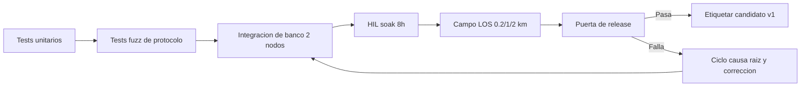

# Test Plan v1

## Goal

Verificar funcionalidad, robustez y desempeno para llevar el protocolo a pruebas de campo con riesgos controlados.

## Test pipeline

## 1) Unit tests

- CRC16: vectores conocidos y mutacion de bytes.
- Codec: serialize/deserialize, truncado, payload_len invalido.
- Ring buffer: overflow, underflow, wrap-around.
- Time sync: convergencia de offset y estabilidad con drift sintetico.

## 2) Protocol robustness tests

- Fuzz parser: bytes aleatorios, headers corruptos, longitudes extremas.
- Sequence window: duplicados, out-of-order, gaps.
- Retry policy: NACK repetidos, timeout y max retries.
- Recovery behavior: reconexion y vaciado de buffer local.

## 3) Bench integration (lab)

- Join de nodo y asignacion de ID/slot.
- Inicio/parada de stream por comando.
- ACK/NACK en condiciones nominales.
- Emulacion de perdida RF con atenuacion controlada.

## 4) Stability soak

- Corrida minima: 8 horas con 2 nodos.
- Corrida objetivo: 24 horas para pre-campo.
- Registrar:
  - dropped frames
  - retransmisiones por nodo
  - drift temporal
  - ocupacion de buffer
  - resets por watchdog/brownout

## 5) Field tests LOS

- Distancias: 0.2 km, 1 km, 2 km.
- Escenarios: linea de vista limpia y perturbada.
- KPI obligatorios:
  - PER
  - RSSI
  - latencia extremo a extremo
  - continuidad de stream
  - error budget de sincronizacion

## 6) Release gate criteria

- Parser robusto sin crash ante entradas invalidas.
- Reconexion automatica tras perdida de enlace.
- Sincronizacion dentro de objetivo operativo.
- Sin perdida silenciosa (drops siempre reportados).
- Bitacora de pruebas con evidencia reproducible.
