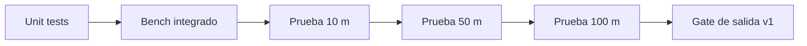

# Test Plan v1

## Objetivo

Validar de forma objetiva que el nuevo enfoque funciona en 100 m LOS con comportamiento determinista y recuperable.

## Pipeline de validacion

## 1) Unit tests

- CRC16
- Codec
- Fragmentacion/reensamble
- Parser FSM de stream
- Scheduler MAC
- Slot gating en nodo
- ACK/NACK + transaction manager

## 2) Bench integrado

Escenario minimo:

- 1 base + 2 nodos
- scheduler activo
- tx en slots
- feedback ACK/NACK

Validar:

- asignacion de slots
- no tx fuera de slot
- retries bajo timeout controlado
- transicion a recovery cuando se agota presupuesto

## 3) Campo por etapas

- Etapa 1: 10 m LOS
- Etapa 2: 50 m LOS
- Etapa 3: 100 m LOS

Registrar en cada etapa:

- PER
- RSSI medio y minimo
- latencia media/p95
- retries por frame
- numero de recoveries

## 4) Criterios de aprobacion

- Sin perdida silenciosa.
- ACK/NACK consistente con secuencia enviada.
- Recovery funcional ante perdida temporal.
- PER dentro del umbral acordado para 100 m.

## 5) Evidencia minima por corrida

- Configuracion usada (canal, bitrate, potencia, timeout, max_retries).
- CSV o log de eventos con node_id y seq.
- Resumen de KPIs y conclusion.
